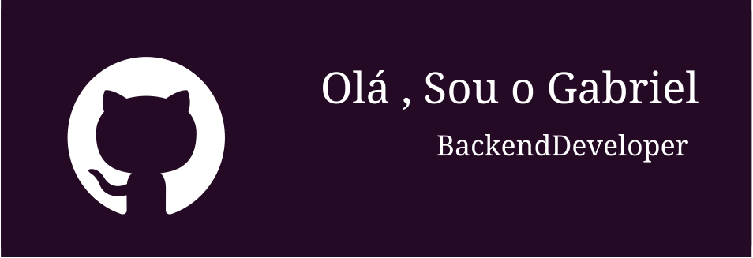

&nbsp;&nbsp;&nbsp;

<h2>🚀 Languages and Tools</h2>

  

    
    
    
    
    
    
    
    
    
    
    <!--  -->
  

 
  <b>⚡ Github Stats</b>
  
  

      
    
    
  

 

<!--
  
<b>Let's connect? 🤝</b>

  
  

    
    
    
    
    
    

  

  -->

